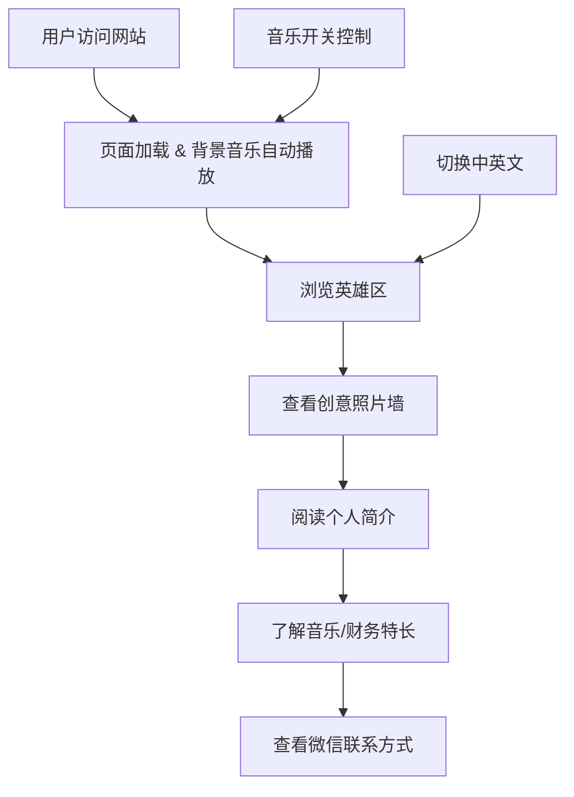

## 1. 产品概述
Rocky个人宣传网站 - 一个融合音乐与财务专业背景的潮酷双语个人展示页。
- 面向国内外朋友展示个人形象、音乐特长和专业背景，支持中英文双语切换
- 打造独特的个人品牌形象，通过视觉设计和音乐氛围传递个性魅力

## 2. 核心功能

### 2.1 功能模块
1. **首页**：语言切换、导航栏、英雄区、个人简介、照片展示墙、兴趣特长、联系方式、音乐播放控制
2. 单页应用，通过锚点导航到各个区块

### 2.2 页面详情
| 页面名称 | 模块名称 | 功能描述 |
|---------|---------|---------|
| 首页 | 语言切换 | 中英文双语一键切换，所有文案实时更新 |
| 首页 | 导航栏 | 固定顶部，平滑滚动到对应区块，支持中英文 |
| 首页 | 英雄区(Hero) | 大标题展示姓名和身份标签，背景动态效果 |
| 首页 | 个人简介 | 个人基本信息介绍：地区、职业、特长、状态 |
| 首页 | 照片展示区 | 三张个人照片以创意堆叠/3D旋转形式展示，带悬停效果 |
| 首页 | 兴趣特长 | 音乐特长展示（电吉他、木吉他）、财务专业背景 |
| 首页 | 联系方式 | 微信号展示，二维码区域 |
| 首页 | 音乐播放器 | 背景音乐自动播放（带开关控制），可暂停/播放 |

## 3. 核心流程
用户访问网站 → 自动播放背景音乐 → 浏览英雄区 → 查看照片展示 → 阅读个人简介和特长 → 滑到底部查看微信联系方式 → 可随时切换中英文语言

## 4. 用户界面设计
### 4.1 设计风格
- **主色调**：深邃黑/深灰为主，搭配金色/琥珀色点缀，营造高级音乐质感
- **辅助色**：蓝色（科技感）、酒红色（音乐/艺术氛围）
- **按钮风格**：圆润精致，带渐变和发光效果，悬停有微动画
- **字体**：使用现代无衬线字体，标题有设计感，正文清晰易读
- **布局**：全屏单页设计，区块分明，有视觉层次，支持不对称布局
- **图标风格**：简约线性图标，音乐相关元素用吉他、音符等装饰
- **整体风格**：潮酷、有音乐氛围感、现代简约但不失个性

### 4.2 页面设计概览
| 页面名称 | 模块名称 | UI元素 |
|---------|---------|-------|
| 首页 | 语言切换 | 右上角固定切换按钮，中英文标签，滑动切换效果 |
| 首页 | 导航栏 | 半透明磨砂玻璃效果，logo在左，导航链接在右 |
| 首页 | 英雄区 | 全屏高度，大标题渐入动画，背景渐变+粒子效果，滚动提示 |
| 首页 | 照片展示区 | 3D堆叠/旋转相册效果，悬停放大，点击切换，错位布局 |
| 首页 | 个人简介 | 卡片式布局，信息项带图标，渐入动画 |
| 首页 | 兴趣特长 | 左右分栏：音乐（吉他图标+深色背景）vs 财务（图表图标+商务背景） |
| 首页 | 联系方式 | 微信二维码展示区域，微信号高亮显示，温馨提示 |
| 首页 | 音乐控制 | 右下角悬浮按钮，旋转唱片效果，点击暂停/播放 |

### 4.3 响应式设计
- 桌面优先设计，适配1920px/1440px/1024px
- 平板适配：768px，布局调整为单列
- 手机适配：375px/390px，照片墙改为垂直排列，导航简化
- 触摸优化：按钮尺寸足够大，照片滑动切换
