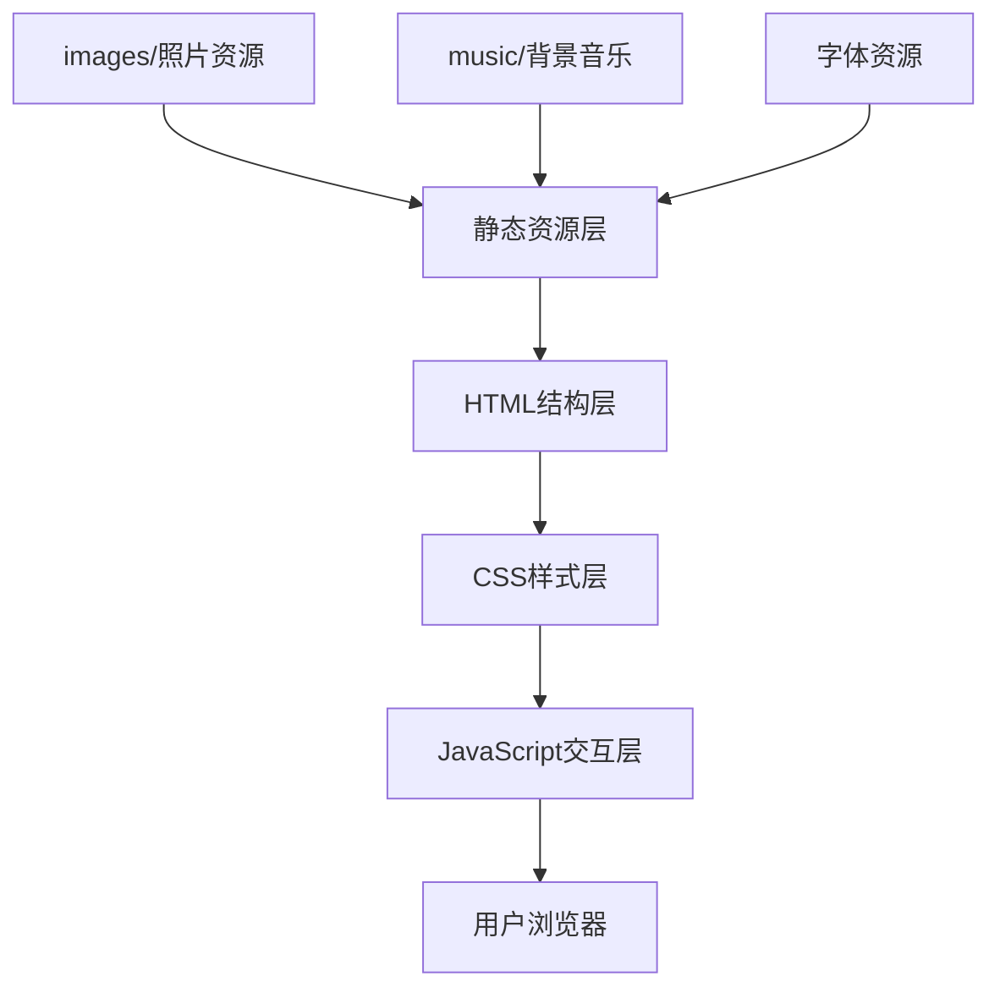

## 1. 架构设计



纯静态单页网站，无后端服务，所有资源本地相对路径引用。

## 2. 技术说明
- **前端**：纯 HTML5 + CSS3 + Vanilla JavaScript（无框架，保证轻量快速）
- **样式方案**：原生 CSS 使用 CSS Variables 管理主题色，Flexbox/Grid 布局，CSS Animations/Transitions 实现动画
- **构建工具**：无需构建，直接浏览器打开即可运行
- **图标**：使用 Unicode 音乐符号和 CSS 绘制，或内联 SVG
- **图片处理**：用户提供的照片放入 images/ 文件夹，使用相对路径引用

选择纯 HTML/CSS/JS 的理由：
1. 轻量，无需安装依赖，双击即可打开
2. 部署简单，可直接托管到任何静态页面服务（Cloudflare Pages等）
3. 性能优秀，无框架开销

## 3. 页面路由
| 路由 | 用途 |
|-----|------|
| index.html | 唯一页面，单页应用，通过锚点导航到不同区块 |

锚点定义：
- #home - 英雄区
- #about - 个人简介
- #gallery - 照片展示
- #skills - 特长展示
- #contact - 联系方式

## 4. 目录结构
```
Rocky/
├── index.html          # 主页面
├── style.css           # 样式文件
├── script.js           # 交互脚本
├── images/             # 图片文件夹
│   ├── photo1.jpg      # 照片1（山顶摇滚手势）
│   ├── photo2.jpg      # 照片2（咖啡馆窗边）
│   ├── photo3.jpg      # 照片3（飞机旁）
│   └── wechat-qr.png   # 微信二维码（待用户提供，暂时用占位）
└── music/              # 音乐文件夹
    └── background.mp3  # 背景音乐（预留位置）
```

## 5. 核心功能实现方案
### 5.1 双语切换
- 使用 JavaScript 维护中英文文案对象
- 通过给元素添加 data-i18n 属性，切换语言时遍历更新
- 使用 localStorage 记住用户语言偏好

### 5.2 照片展示
- CSS 3D Transform 实现堆叠旋转效果
- 鼠标悬停时当前照片突出放大
- 自动轮播 + 手动切换结合

### 5.3 背景音乐
- HTML5 Audio API
- 右下角悬浮控制按钮（旋转唱片动画）
- 首次访问尝试自动播放，若被浏览器拦截则提示用户点击
- 记住用户播放/暂停偏好

### 5.4 响应式布局
- 使用 CSS Media Queries
- Mobile: 768px以下
- Tablet: 768px-1024px
- Desktop: 1024px以上
